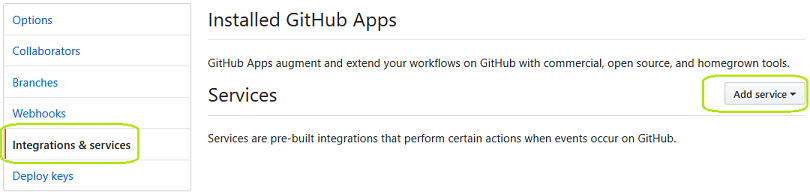
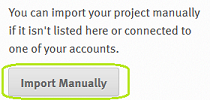
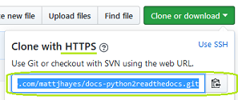
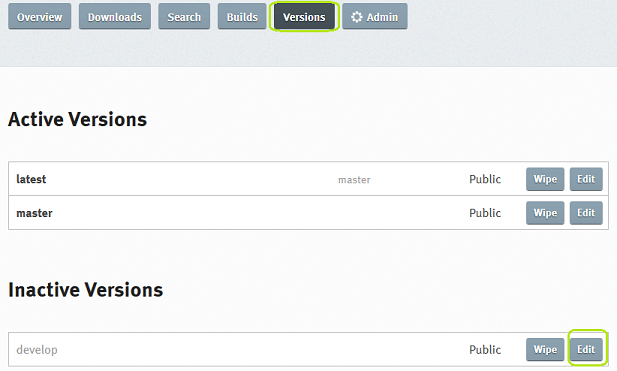
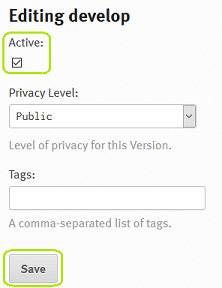

#########################
Read the Docs Integration
#########################

**************************
Integrate with ReadtheDocs
**************************

Sign up with Read the Docs
==========================

Sign up for a Read the Docs account at:

`<https://readthedocs.org/>`_

Create Integration in Read the Docs
===================================

Go into Admin -> Integrations and click 'Add integration'

.. image:: rtd_integrations_1.png

Select Integration type as 'GitHub incoming webhook' then click 'Add integration'

.. image:: rtd_integrations_2.png

Copy the Webhook URL to clipboard

.. image:: rtd_integrations_3.png

Set up Service on GitHub
========================

Go into the admin page for the project on GitHub.

Go to the “Settings” page for your project

* Click “Integrations & services” on the left
* In the “Services” section, click “Add service”

* In the list of available services, click “ReadTheDocs”
* Check “Active”
* Click “Add service”

Import Project in Read the Docs
===============================

Log into Read the Docs and click 'Import a Project'.

.. image:: images/rtd_import_1.png

If the project is not in the list, choose to import it manually:

In GitHub, copy the HTTPS clone URL to clipboard:

Back in Read the Docs, paste the URL into the 'Repository URL field' and fill in the project name: 

Check Read the Docs Versions
============================

Check Read the Docs versions are enabled appropriately for the repository.

Enable where required:

********************************************
Autodoc Fix for External Module Dependencies
********************************************

Read the Docs runs Sphinx autodoc against your code in its environment.
So, while autodoc may run fine in your own environment, it may fail in
ReadtheDocs, due to imported modules not being present.

Example of Import Problem
=========================

In Read the Docs, we can see example_module, but not example_module2

We check the build and it passed. What is the problem?

Clicking in Read the Docs admin interface on the 4th line of the build,
we see:

and further down this output:

Right. It's failing because colouredlogs module isn't installed in Read the
Docs.

There are a couple of ways to fix this if it is a problem. The first one is
preferable:

Fixing Missing Imports with virtualenv
======================================

In this fix, we tell ReadtheDocs to install module dependencies via pip in a
virtual environment, and then run Sphinx autodoc.

Enable virtualenv in Read the Docs
----------------------------------

Log into Read the Docs and go into Settings -> Profile -> <PROJECT_NAME>

Go into Admin -> Advanced Settings and tick the
'Install your project inside a virtualenv using setup.py install' box

Fill in the 'Requirements file:' box with requirements.txt

Click 'Submit'

Create a requirements.txt file
------------------------------

Create requirements.txt file (
`example <https://github.com/mattjhayes/docs-python2readthedocs/blob/master/requirements.txt>`_ )
in root of project. Here is an example
requirements.txt file to install the coloredlogs library:

.. code-block:: text

  # Install coloredlogs:
  coloredlogs

Replace coloredlogs with the name(s) of the programs to install with pip.

Fixing Missing Imports with Mock
================================

If the virtualenv solution isn't fully working from you then consider using
mock. Code can be added to docs/source/conf.py to mock troublesome imports
so that Read the Docs Sphinx doesn't error trying to load them.

Sub-modules must be listed after their parent module and there must be full
listing from the top level module. Example that mocks ryu.base.app_manager:

.. code-block:: python

  import mock

  MOCK_MODULES = [
      'ryu',
      'ryu.base',
      'ryu.base.app_manager']

  for mod_name in MOCK_MODULES:
      sys.modules[mod_name] = mock.Mock()

